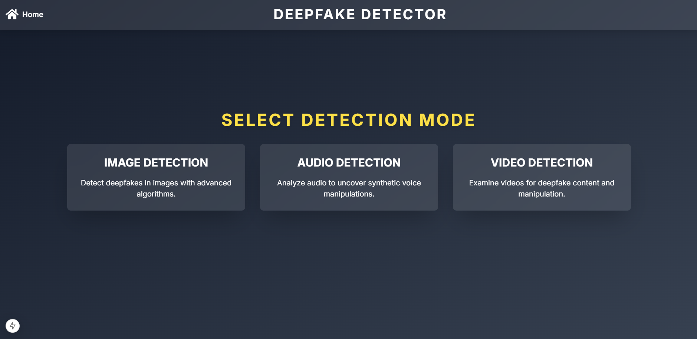
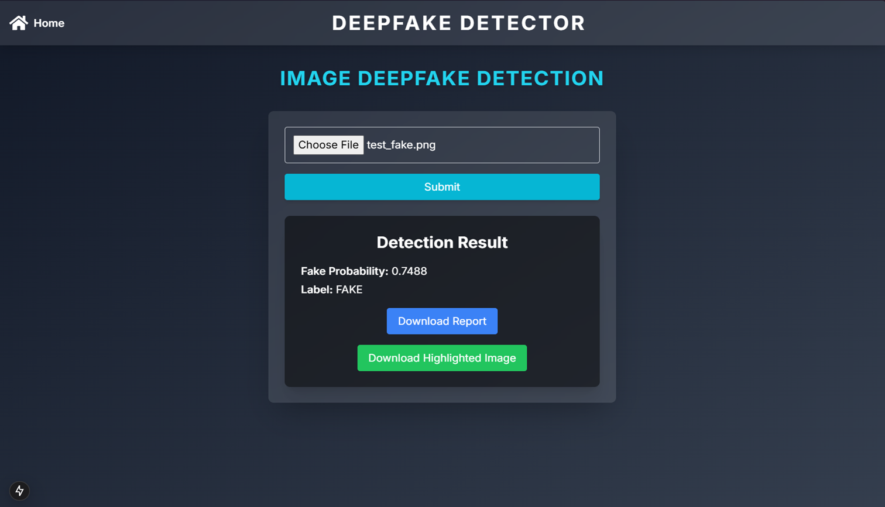
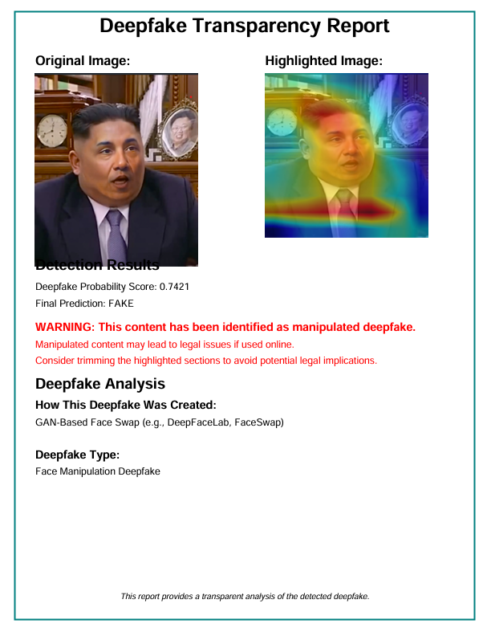
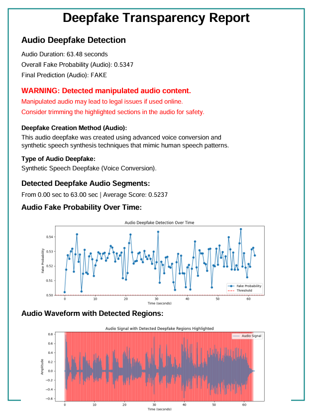

# DEEP-SCANNER 🔍

An advanced deep learning project for detecting NSFW content across multiple media types - images, videos, and audio.

[Project Demo/Screenshots to be added]

## 🌟 Features

- **Multi-Modal Detection**: Comprehensive scanning across different media types
- **Real-Time Processing**: Fast and efficient content analysis
- **High Accuracy**: Powered by state-of-the-art deep learning models
- **User-Friendly Interface**: Clean and intuitive web application

## 🛠️ Tech Stack

- **Frontend**: React.js
- **Backend**: Python, Flask
- **Deep Learning**: TensorFlow, PyTorch
- **Cloud Infrastructure**: Google Colab (T4-GPU Runtime)

## 🚀 Getting Started

### Prerequisites

- Node.js
- Python 3.8+
- Google Colab Account
- Ngrok Account
- Git

### Model Downloads

Download the pre-trained models from the following links:

- [Image and Video Models](https://drive.google.com/drive/folders/1_-Q0WuoRPdsWTzhmVfxa5hgM9ic3yL7f?usp=sharing)
- [Audio Models](https://drive.google.com/drive/folders/13McqGsCUpcVjZ9mIZXcetRTlwA50hxBE?usp=sharing)

### Setup Instructions

#### Backend Setup

1. Open the backend notebook (`backend.ipynb`) in Google Colab
2. Select T4-GPU runtime in Colab:
   - Navigate to `Runtime → Change runtime type`
   - Select `T4 GPU` from the dropdown
   - Click `Save`

3. Set up Ngrok:
   - Create an account on [Ngrok](https://ngrok.com/)
   - Copy your auth token from the dashboard
   - Replace `YOUR_AUTH_TOKEN` in the backend code with your actual token

4. Run all cells in the notebook

#### Frontend Setup

1. Clone the repository:
```bash
git clone https://github.com/priyanshusoni3850/DEEP-SCANNER
cd DEEP-SCANNER/frontend
```

2. Install dependencies:
```bash
npm install
```

3. Create a `.env` file in the frontend directory:
```env
REACT_APP_BACKEND_URL=your_ngrok_url
```

4. Start the frontend:
```bash
npm start
```

## 📸 Project Screenshots



[Add screenshots of your application interface here]

## 🎯 Results




[Add screenshots/examples of detection results here]

## 🔑 Key Features Explained

- **Image Detection**: Analyzes images for Deepfake or Morphed content using advanced Xception-net models
- **Video Processing**: Frame-by-frame analysis for comprehensive video scanning
- **Audio Analysis**: Processes audio content for inappropriate speech or sounds
- **Real-Time Feedback**: Instant results with confidence scores

## 🤝 Contributing

Contributions are welcome! Please feel free to submit a Pull Request.

## 📄 License

This project is licensed under the MIT License - see the [LICENSE](LICENSE) file for details.

## 📞 Contact

- GitHub: [@priyanshusoni3850](https://github.com/priyanshusoni3850)

---

⭐ Star this repository if you find it helpful!
